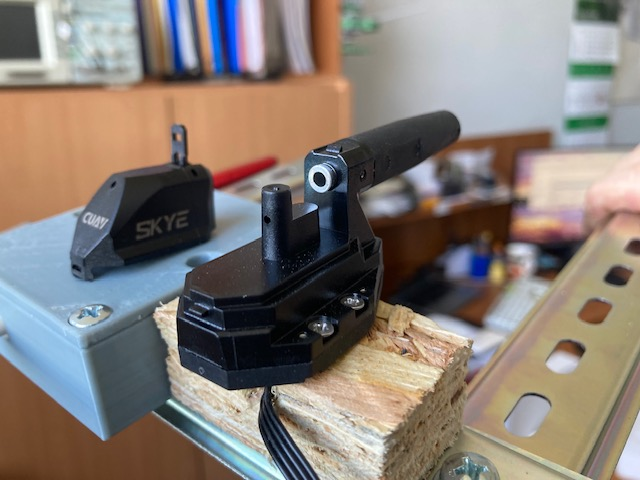
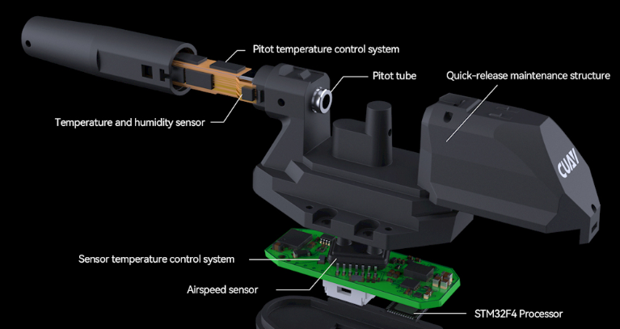

Протокол випробувань датчика повітряної швидкості Сафір-М
=========================================================

Дата випробувань: 2024-05-15

    
Алгоритм розрахунку повітряної швидкості
----------------------------------------

В результаті випробувань розрахованонаступні показникі повітряної швидкості:

* IAS - індикаторна швидкість
* CAS, TAS - відкалібрована швидкість, що дорівнює істинній швидкості
* EAS - еквівалентна швидкість

.. math::

    AirSpeed = \sqrt{\frac{2*\Delta P}{\rho}}

    \rho = \frac{AbsPressure}{287*(Temperature+273.15)}

, де

AbsPressure
    Абсолютний тиск (Бар) виміряний датчиком абсолютного тиску
Temperature
    * при розрахунку IAS, CAS -- виміряна температура (С) датчика перепаду тиску
    * при розрахунку EAS -- 15 C
Delta P
    * при розрахунку IAS -- виміряний перепад тиску на датчику
    * при розрахунку CAS -- різниця між виміряним перепадом на коефіцієнтом корекціі перепаду
    * при розрхунку EAS -- 1.01325 (Бар)

Калібровка каналу статики
-------------------------

Drop=0.0026(Bar) IAS=20.8(m/s) CAS=0.0(m/s) EAS=0.0(m/s)

Траса Київ-Житомир
-------------------

.. csv-table::
    :header: Time, Abs_Pres, Drop, Temp, IAS, CAS, EAS, Vgps, "Vgps/CAS"
   
    , , Bar, Bar, C, "m/s", "m/s", "m/s", "m/s"
    15:04:32.7, 1.02033, 0.00255, 19.1, 20.5, 0.0, 0.0, 0.0, 1.0
    15:07:51.6, 1.01974, 0.00443, 18.5, 27.0, 16.6, 16.6, 16.7, 1.01
    15:08:30.1, 1.01938, 0.00412, 18.4, 26.0, 15.0, 14.9, 16.7, 1.11
    15:09:59.6, 1.01911, 0.00589, 18.1, 31.1, 22.7, 22.6, 22.2, 0.978
    15:11:21.4, 1.01797, 0.00669, 17.6, 33.1, 25.4, 25.4, 20.3, 0.799
    15:17:28.5, 1.02131, 0.0089, 16.5, 38.1, 31.6, 31.7, 28.3, 0.896
    15:18:09.3, 1.0221, 0.00964, 16.5, 39.6, 33.5, 33.5, 30.6, 0.913
    15:19:30.9, 1.02578, 0.0073, 16.4, 34.4, 27.2, 27.3, 25.0, 0.919
    15:24:21.9, 1.01685, 0.01199, 16.2, 44.2,38.8, 38.8, 33.3, 0.858
    15:25:49.4, 1.01574, 0.0154, 16.3, 50.2, 45.5, 45.4, 36.4, 0.8

Середне значення поправки на діапазон Vgps/CAS=0,928

Траса Житомир-Київ
-------------------

.. csv-table::
    :header: Time, Abs_Pres, Drop, Temp, IAS, CAS, EAS, Vgps, "Vgps/CAS"
   
    , , Bar, Bar, C, "m/s", "m/s", "m/s", "m/s"
    15:48:05.5, 1.01984, 0.00717, 15.6, 34.1, 26.8, 26.9, 22.2, 0.828
    15:49:18.7, 1.01542, 0.01464, 15.8, 48.9, 44.1, 44.1, 31.9, 0.723
    15:50:11.9, 1.01863, 0.00702, 15.9, 33.8, 26.4, 26.4, 20.3, 0.907
    15:51:38.3, 1.01509, 0.01521, 15.8, 49.9, 45.1, 45.1, 36.1, 1.37

Середне значення поправки на діапазон Vgps/CAS=0,957

Повторне калібрування каналу статики
""""""""""""""""""""""""""""""""""""

Перевірка при Vgps=0 m/s:

Abs_Pres=1.02073 Bar Drop=0.00303(Bar) Drop_temp=15.9(C) IAS=22.2(m/s) CAS=0.7(m/s) EAS=0.7(m/s)

Задане значення зміщення drop_offset=0.00303 Bar

Перевірка після введення калібрування при Vgps=0 m/s: 

Abs_Pres=1.02072 Bar Drop=0.00297(Bar) Drop_temp=15.9(C) IAS=22.0(m/s) CAS=0.0(m/s) EAS=0.0(m/s)

.. csv-table::
    :header: Time, Abs_Pres, Drop, Temp, IAS, CAS, EAS, Vgps, "Vgps/CAS"

    , , Bar, Bar, C, "m/s", "m/s", "m/s", "m/s"   
    15:57:47.3, 1.01375, 0.02209, 16.0, 60.1, 55.9, 55.8, 38.9, 0.696
    15:58:23.5, 1.01855, 0.00942, 16.0, 39.2, 32.3, 32.3, 27.8, 0.861
    15:59:39.3, 1.02386, 0.00748, 15.9, 34.8, 26.8, 26.9, 21.9 , 0.817

Середне значення поправки на діапазон Vgps/CAS=0.791

Протокол випробувань датчика повітряної швидкості SKYE
======================================================

Датчик повітряної швидкості SKYE містить керамічні нагрівальні елементи та замкнутий контур стабілізації
тетмператури трубки Піто. Температура підтримується постійною на рівні 43 С.
Датчик повітряної швидкості SKYE містить вбудований датчик вологості повітря.

Повітряна швидкість
------------------
.. csv-table::
    :header: Vgps, Vskye, "Vgps/Vskye"

    m/s, m/s
    36.6, 41, 0.892
    9.4, 10, 0.94
    38.9, 50, 0.778

Середне значення поправки на діапазон Vgps/Vskye=0.87

Перепад тиску
----------------

.. csv-table::
    :header: Vgps, 0, 31.9, 36.1, 37.5, 25.0

    Bar, -0.0002137, 0.005205, 0.003559, 0.00375, 0.00355

Висновки
========

1. Розрахункові значення повітряної швидкості датчиків співпадають в межах стохастичних виміряних значень
2. Трубка Піто датчика Сафір-М cуттєво відрізняється від конструкції датчика SKYE:
    * не містить камери усереднення сигналу швидкісного напору;
    * порожнина динамічного тиску датчика Сафір-М замкнена, тоді як в датчику SKYE вона проточна;
    * забір повного тиску призводится по польоту, тоді як у датчика SKYE від отвору, який повернений проти польоту.
3. Перелічені особливості датчика SKYE призводять до суттєво менших виміряних значень перепаду тиску на датчику SKYE та
   можливо направлені на суттєво зниження коливань тиску та підвищення демферних властивостей каналу повного тиску.
4. В датчику Сафір-М відсутні контур стабілізації температури датчика та вимірювання вологості повітря.

https://www.cuav.net/en/_skye/

