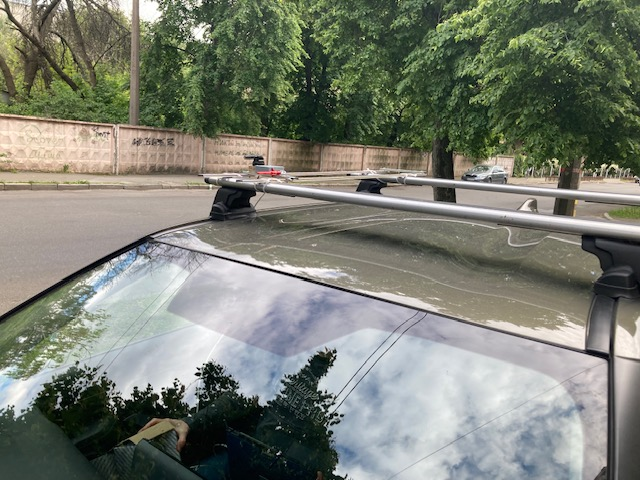

Протокол випробувань датчика повітряної швидкості Сафір-М
=========================================================

    
Алгоритм розрахунку повітряної швидкості
----------------------------------------

.. math::

    AirSpeed = \sqrt{\frac{2*\Delta P}{\rho}}

    \rho = \frac{AbsPressure}{287*(Temperature+273.15)}

, де

AbsPressure
    Абсолютний тиск (Бар) виміряний датчиком абсолютного тиску
Temperature
    * при розрахунку IAS, CAS -- виміряна температура (С) датчика перепаду тиску
    * при розрахунку EAS -- 15 C
Delta P
    * при розрахунку IAS -- виміряний перепад тиску на датчику
    * при розрахунку CAS -- різниця між виміряним перепадом на коефіцієнтом корекціі перепаду
    * при розрхунку EAS -- 1.01325 (Бар)

Калібровка каналу статики
-------------------------

2024-05-15T14:55:47.883543 Abs_Pres=1.02045 Bar Drop=0.0026(Bar) Drop_temp=21.9(C) IAS=20.8(m/s) CAS=0.0(m/s) EAS=0.0(m/s)

Траса Київ-Житомир
-------------------

Vgps=0 m/s

2024-05-15T15:04:32.754897 Abs_Pres=1.02033 Bar Drop=0.00255(Bar) Drop_temp=19.1(C) IAS=20.5(m/s) CAS=0.0(m/s) EAS=0.0(m/s)

Vgps=16.7 m/s k=1.00

2024-05-15T15:07:51.643008 Abs_Pres=1.01974 Bar Drop=0.00443(Bar) Drop_temp=18.5(C) IAS=27.0(m/s) CAS=16.6(m/s) EAS=16.6(m/s)

Vgps=16.7 m/s k=1.12

2024-05-15T15:08:30.186521 Abs_Pres=1.01938 Bar Drop=0.00412(Bar) Drop_temp=18.4(C) IAS=26.0(m/s) CAS=15.0(m/s) EAS=14.9(m/s)

Vgps=22.2 m/s k=0.982

2024-05-15T15:09:59.672644 Abs_Pres=1.01911 Bar Drop=0.00589(Bar) Drop_temp=18.1(C) IAS=31.1(m/s) CAS=22.7(m/s) EAS=22.6(m/s)

Vgps=20.3 m/s k=0.799

2024-05-15T15:11:21.403022 Abs_Pres=1.01797 Bar Drop=0.00669(Bar) Drop_temp=17.6(C) IAS=33.1(m/s) CAS=25.4(m/s) EAS=25.4(m/s)

Vgps=28.3 m/s k=0.893

2024-05-15T15:17:28.573702 Abs_Pres=1.02131 Bar Drop=0.0089(Bar) Drop_temp=16.5(C) IAS=38.1(m/s) CAS=31.6(m/s) EAS=31.7(m/s)

Vgps=30.6 m/s k=0.913

2024-05-15T15:18:09.354909 Abs_Pres=1.0221 Bar Drop=0.00964(Bar) Drop_temp=16.5(C) IAS=39.6(m/s) CAS=33.5(m/s) EAS=33.5(m/s)

Vgps=25.0 m/s k=0.916

2024-05-15T15:19:30.939197 Abs_Pres=1.02578 Bar Drop=0.0073(Bar) Drop_temp=16.4(C) IAS=34.4(m/s) CAS=27.2(m/s) EAS=27.3(m/s)

Vgps=33.3 m/s  k=0.858

2024-05-15T15:24:21.988314 Abs_Pres=1.01685 Bar Drop=0.01199(Bar) Drop_temp=16.2(C) IAS=44.2(m/s) CAS=38.8(m/s) EAS=38.8(m/s)

Vgps=36.4 m/s k=0.802

2024-05-15T15:25:49.488866 Abs_Pres=1.01574 Bar Drop=0.0154(Bar) Drop_temp=16.3(C) IAS=50.2(m/s) CAS=45.5(m/s) EAS=45.4(m/s)

Траса Житомир-Київ
-------------------

Vgps=22.2 m/s k=0.825

2024-05-15T15:48:05.541509 Abs_Pres=1.01984 Bar Drop=0.00717(Bar) Drop_temp=15.6(C) IAS=34.1(m/s) CAS=26.8(m/s) EAS=26.9(m/s)

Vgps=31.9 m/s k=0.723

2024-05-15T15:49:18.745861 Abs_Pres=1.01542 Bar Drop=0.01464(Bar) Drop_temp=15.8(C) IAS=48.9(m/s) CAS=44.1(m/s) EAS=44.1(m/s)

Vgps=20.3 m/s k=0.907

2024-05-15T15:50:11.905926 Abs_Pres=1.01863 Bar Drop=0.00702(Bar) Drop_temp=15.9(C) IAS=33.8(m/s) CAS=26.4(m/s) EAS=26.4(m/s) ?

Vgps=36.1 m/s k=1.37

2024-05-15T15:51:38.251557 Abs_Pres=1.01509 Bar Drop=0.01521(Bar) Drop_temp=15.8(C) IAS=49.9(m/s) CAS=45.1(m/s) EAS=45.1(m/s)

Повторне калібрування каналу статики
""""""""""""""""""""""""""""""""""""

Vgps=0 m/s

2024-05-15T15:54:08.049264 Abs_Pres=1.02083 Bar Drop=0.00303(Bar) Drop_temp=15.8(C) IAS=22.2(m/s) CAS=6.8(m/s) EAS=6.8(m/s)

Vgps=0 m/s

2024-05-15T15:55:50.604485 Abs_Pres=1.02073 Bar Drop=0.00303(Bar) Drop_temp=15.9(C) IAS=22.2(m/s) CAS=0.7(m/s) EAS=0.7(m/s)

Calibration for drop_offset=0.00303 Bar Vgps=0 m/s

2024-05-15T15:56:50.788845 Abs_Pres=1.02072 Bar Drop=0.00297(Bar) Drop_temp=15.9(C) IAS=22.0(m/s) CAS=0.0(m/s) EAS=0.0(m/s)

Vgps=38.9 m/s k=0.697

2024-05-15T15:57:47.340841 Abs_Pres=1.01375 Bar Drop=0.02209(Bar) Drop_temp=16.0(C) IAS=60.1(m/s) CAS=55.9(m/s) EAS=55.8(m/s)

Vgps=27.8 m/s k=0.861

2024-05-15T15:58:23.589694 Abs_Pres=1.01855 Bar Drop=0.00942(Bar) Drop_temp=16.0(C) IAS=39.2(m/s) CAS=32.3(m/s) EAS=32.3(m/s)

Vgps=21.9 m/s k=0.814

2024-05-15T15:59:39.324658 Abs_Pres=1.02386 Bar Drop=0.00748(Bar) Drop_temp=15.9(C) IAS=34.8(m/s) CAS=26.8(m/s) EAS=26.9(m/s)

Протокол испытаний датчика воздушной скорости SKYE
==================================================

Воздушная скорость
------------------

Vgps=36.6 m/s Vskye=41 m/s

Vgps=9.4 m/s Vskye=10 m/s

Vgps=38.9 m/s Vskye=50 m/s

Скоростной напор
----------------

Vgps=0 m/s dPskye=-21.37

Vgps=31.9 m/s dPskye=520.5

Vgps=36.1 m/s dPskye=355.9

Vgps=37.5 m/s dPskye=375.9

Vgps=25.0 m/s dPskye=355
