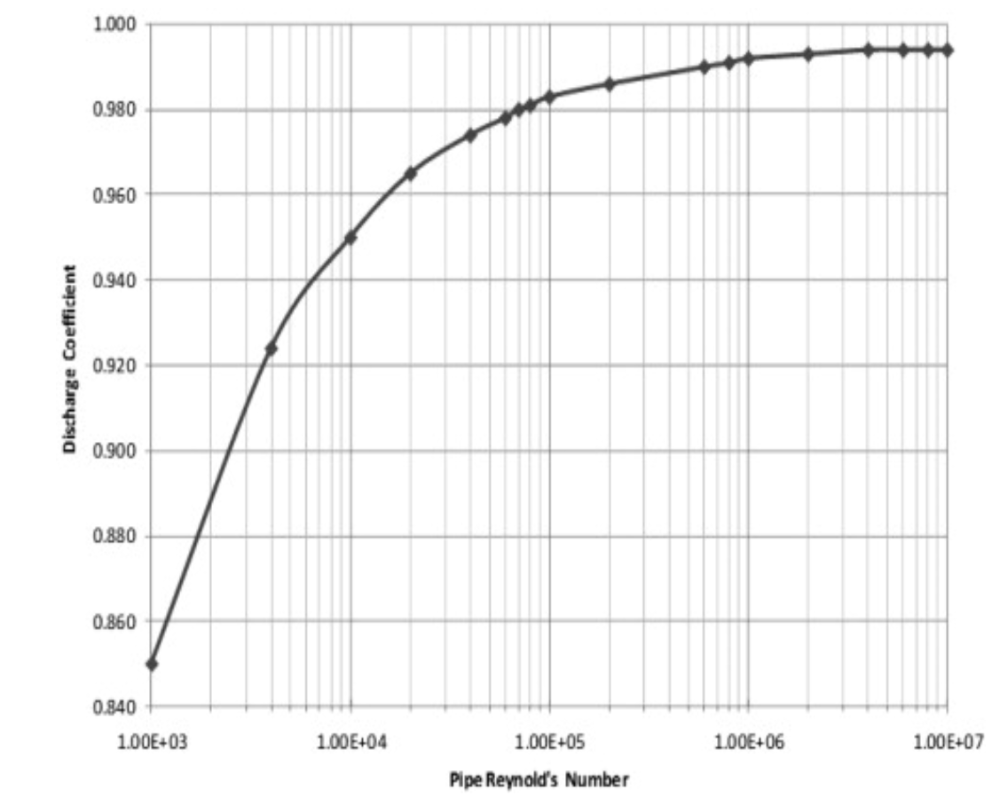

=============================
ТЕХНІЧНЕ ЗАВДАННЯ
=============================

на розробку датчика повітряних сигналів ДПС

Технічні характеристики прототипів
---------------------------------------------

Qio-Tek ASP5033 CAN
~~~~~~~~~~~~~~~~~~~~~~~

* Діапазон виміру: -20Па - +20000 Па
* Точність: +/- 0.2%
* Максимальна похибка: 0.5%
* Перевантаження по тиску: 2-кратне
* Точність вимірювання температури: +/- 1°C
* Напруга живлення: 4.5 - 12 В
* Споживання струму: менше 8 мкА (один вимір)
* Статичне споживання: менше 0,12 мкА (при 25°C)
* Робоча температура: -40°C - +125°C
* Точність виміру: +-/0.5°C при 25°C
* Вага: 2 г

MS4525DO
~~~~~~~~~~~~~~~~~~

* Діапазон виміру: 7 - 1000 Па
* Максимальна похибка 1%
* Напруга живлення: 3.5 - 5 В
* Розрядність АЦП каналу тиску 14 біт
* Розрядність АЦП каналу температури 11 бит
* Порт тиску 1/8"

Алгоритм розрахунку на базі трубки Піто
----------------------------------------------------------------

Вихідні дані розрахунку
~~~~~~~~~~~~~~~~~~~~~~~~~~~~

* :math:`T_{H0}=288.15` - температура повітря на рівні моря
* :math:`P_{H0}=101325.0, Па` - тиск повітря на рівні моря
* :math:`g=9.80665, \frac{м}{с^2}` - прискорення вільного падіння
* :math:`R=287.05287, \frac{Дж}{кГ*К}` - універсальна газова стала повітря
* :math:`b_{11}=0.0065, \frac{K}{м}` - швидкість зниження температури по висоті
* :math:`k=1.4` - показник адіабати повітря

Вимірювальні параметри
~~~~~~~~~~~~~~~~~~~~~~~~~~~~

* :math:`\Delta P = P^*_H - P_H` - перепад тиску на трубці Піто
* :math:`P_H` - статичний тиск на висоті
* :math:`T_H` - температура повітря на висоті

Розрахункові парамtтри
~~~~~~~~~~~~~~~~~~~~~~~

* :math:`H, м` - висота
* :math:`М` - число Маха
* :math:`\sigma=\frac{\rho}{\rho_0}, \frac{кГ}{м^3}` - відносна густина повітря на висоті
* :math:`V_{EAS}` - еквівалентна швидкість польота для умов на рівні моря
* :math:`V_{TAS}` - істинна швидкість на висоті

Параметри стандартної атмосфери (ГОСТ 4401-73)
~~~~~~~~~~~~~~~~~~~~~~~~~~~~~~~~~~~~~~~~~~~~~~~~~~~~

Статична температура
""""""""""""""""""""

.. math::
    :label: (1)

    T_H = T_{H0} - b_{11}*H

Статична температура повітря на висоті 10 км над рівнем моря згідно з :eq:`(1)`
складає:

.. math::

    T_{10} &= 288.15-0.0065*10000

           &= 223.15, К

Статичний тиск
""""""""""""""""""""

.. math::
    :label: (2)

    P_H = P_{H0} * \left(1-\frac{b_{11}*H}{T_{H0}}\right)^{
                    \frac{g}{b_{11}*R}}

Статичний тиск повітря на висоті 10 км над рівнем моря згідно з :eq:`(2)`
складає:

.. math::

    P_{10} &= 101325*\left(1-\frac{0.0065*10000}{288.15}\right)**
              \frac{9.80665}{0.0065*287.05287}

           &= 26436.2, Па

Густина повітря
""""""""""""""""

.. math::
    :label: (3)

    \rho = \frac{P}{R*T}

Густина повітря на рівні моря згідно з :eq:`(3)` складає:

.. math::

    \rho_0 &= \frac{101325}{287.05287*288.15}

           &= 1.225, \frac{кГ}{м^3}

Висота польоту
~~~~~~~~~~~~~~~~~~~~~~~~~~~~~

http://mgsys.kpi.ua/article/view/147340

Розраховується згідно :eq:`(2)`

.. math::
    :label: (4)

    H =\frac{T_{H0}}{b_{11}}\left[1-\left(\frac{P_H}{P_{H0}}\right)^\frac{b_{11}*R}{g}\right]

Висота над рівнем моря згідно з раніше отриманими параметрами для висоти 10 км
згідно з :eq:`(4)` складає:

.. math::

    H &=\frac{288.15}{0.0065}\left[1-\left(\frac{26436.2}{101325}\right)^
    \frac{0.0065*287.05287}{9.80665}\right]

    &= 10000, м

Число М польоту
~~~~~~~~~~~~~~~~~

.. math::
    :label: (5)

    M &= \sqrt{\frac{2}{k-1}\left[\left(\frac{P^*_H}{P_{H0}}\right)^
    {\frac{k-1}{k}}-1\right]}

      &= \sqrt{\frac{2}{k-1}\left[\left(\frac{P^*_H-P_{H0}}{P_{H0}}+1\right)^
    {\frac{k-1}{k}}-1\right]}

      &= \sqrt{\frac{2}{k-1}\left[\left(\frac{\Delta P}{P_{H0}}+1\right)^
    {\frac{k-1}{k}}-1\right]}

Для числа М польоту 0.6 повний тиск, розрахований з урахуванням змінної
теплоємності повітря складає :math:`P^*_H=128186, Па`. Згідно з :eq:`(5)`:

.. math::

    M &= \sqrt{\frac{2}{1.4-1}\left[\left(\frac{128186}{101325}\right)
    ^{\frac{1.4-1}{1.4}}-1\right]}

    &= 0.589465

Таким чином помилка розрахунку числа М польоту складає 1.75% від поточного значення.

Швидкість звуку
~~~~~~~~~~~~~~~~~~

.. math::
    :label: (6)

    a=\sqrt{kRT_H}

Для умов на рівні моря швидкість звуку згідно з :eq:`(6)` дорівнює:

.. math::

    a &= \sqrt{1.4*287.05287*288.15}

    &= 340.294, \frac{м}{с}

Еквівалентна швидкість польота для умов на рівні моря
~~~~~~~~~~~~~~~~~~~~~~~~~~~~~~~~~~~~~~~~~~~~~~~~~~~~~~~~~~~

https://agodemar.github.io/FlightMechanics4Pilots/mypages/airspeeds/

.. math::
    :label: (7)

    V_{EAS}=\begin{cases}
                \begin{split}
                    \sqrt{\frac{P^*_H-P_H}{2\rho_0}}=\sqrt{\frac{ 2 \Delta P }{\rho_0}}&, M&\leq0.3\\
                    a*M&, M&> 0.3
                \end{split}
            \end{cases}

де

* :math:`\rho_0` згідно :eq:`(3)`
* :math:`M` згідно :eq:`(5)`
* :math:`a` згідно :eq:`(6)`

Для числа М польоту 0.2 з урахуванням змінної
теплоємності повітря швидкість польоту на рівні моря складає 68.041 м/с, 
повний тиск складає :math:`P^*_H=104040.1, Па`. Згідно з :eq:`(7)`:

.. math::

    V_{EAS} &= \sqrt{\frac{2*104040.1-101325}{1.225}}

    &=66.57, \frac{м}{с}

Похибка розрахунку 2.1%

Істинна швидкість на висоті
~~~~~~~~~~~~~~~~~~~~~~~~~~~~~~~~~~~~

Враховує зміну густини повітря на висоті

.. math::
    :label: (8)

    V_{TAS}=\sqrt{\frac{P^*_H-P_H}{2\rho_0\sigma}}=\sqrt{\frac{ \Delta P }{2\rho_0\sigma}}

де відносна густина повітря

.. math::

    \sigma=\frac{\rho}{\rho_0}=\frac{T_{H0}}{T_H} * \left(1+\frac{b_{11}*H}{T_{H0}}\right)^{
                    \frac{g}{b_{11}*R}}

Алгоритм розрахунку повітряної швидності на базі трубки Вентурі
-----------------------------------------------------------------

* Відносне звуження поперечного перерізу трубки Вентурі 1,6
* Максимальний перепад тиску на швидності 0,8М у землі 71 кПа
* Допустима похибка від поточного значення для похибки швидкості 2 м/с не більше 1,3%

Алгоритм розрахунку швидкості польота
~~~~~~~~~~~~~~~~~~~~~~~~~~~~~~~~~~~~~~~~~~~~~~~~~~

https://www.sciencedirect.com/topics/engineering/venturi-tube

.. math::

    V=C\sqrt{\frac{2g(P_1-P_2)}{\gamma}\left[\left(\frac{1}{\beta}\right)^4-1\right]}

де

:math:`\beta=\frac{d}{D}=0,3... 0,75`

Вимоги електромагнітної сумісності
-------------------------------------

Датчик повинен зберігати працездатність при дії систем радіоелектронного подавлення, 
ненавмисного електромагнітного випромінювання природного та штучного походження 
при дії електромагнітних полів, зазначених у OCT B102763-95.

Сприйняття датчика до електромагнітних перешкод повинне відповідати вимогам 
OCT В1 02763-95 за категорією п.2, п.п.5.1-5.8, 5.10.

Рівні електромагнітних перешкод, які створені датчиком, не повинні перевищувати рівні 
відповідно до вимог OCT В1 02696-90 за всіма видами електромагнітних перешкод 
для електронного обладнання.

Вимоги по живучості та стійкості щодо впливу зовнішніх факторів
-----------------------------------------------------------------

Діапазон робочих температур            -45⁰С…+60⁰С.

Працездатність датчика в широкому діапазоні робочих температур має забезпечуватись за рахунок
застосуванню модулю приймача повітряного тиску (трубки Піто) із обігрівом.

Обладнання, що входить до складу датчика повинне відповідати наступним категоріям у відповідності із 
ДСТУ ISO 7137:2018 (відповідає стандарту RTCA DO-160G):

.. csv-table:: Категорії щодо умов зовнішнього середовища згідно DO160
    :header: "Вимоги", "Категорія "

    
    "Температурний діапазон застосування    ", "С2"
    "Висота застосування				    ", "С2"
    "Вологість						        ", "А"
    "Ударні експлуатаційні навантаження	    ", "D"
    "Вібрація						        ", "S"
    "Сприйнятливість до рідин			    ", "F"
    "Соляний туман					        ", "S"
    "Магнітний вплив					    ", "С"
    "Вхідне електроживлення			        ", "В"
    "Імпульси напруги					    ", "А"
    "Сприйнятливість до перешкод індукції   ", "А"
    "Зледеніння						        ", "С"
    "Електростатичний розряд			    ", "А"
    "Пожежа, займистість				    ", "С"

Датчик має бути стійким до механічних завантажень у відповідності із ГОСТ РВ 20.39.304-98.

Умови експлуатації матеріалів, сплавів, металевих та неметалевих неорганічних покриттів, 
герметиків і компаундів, які використовуються при виготовленні датчика, 
повинні відповідати ГОСТ 9.303-84 і ГОСТ 9.104-79.

Вимоги з надійності
--------------------

Номенклатура показників безвідмовності та довговічності датчика відповідно до ГОСТ В23743-88.

Імовірність безвідмовної роботи датчика на момент розробки та випробувань має складати 
не менше 0,95 за довірчої ймовірності 0,5.

Вимоги до ергономіки та технічної естетики
----------------------------------------------

Дизайнерські рішення при проектуванні датчика повинні забезпечувати інформаційну 
виразність, раціональність форм і культури виробничого виконання і задовольняти 
вимогам промислової естетики за ГОСТ 27629-88.

Датчик повинен відповідати вимогам, які висуваються до ергономіки та 
технічної естетики, що викладені в ОТТВВС-86, ГОСТВ 17 054-86 та ГОСТ В 20.39.308-76.

Вимоги до експлуатації, збереження, зручності технічного обслуговування та ремонту
-----------------------------------------------------------------------------------

Загальні технічні вимоги до датчика повинні відповідати вимогам ГОСТ В20.39.308-76, 
ГОСТ В20.39.304-76, ОТТ ВВС.

Методи та засоби консервації БСКНК повинні забезпечити надійне зберігання протягом 
встановлених термінів в умовах, які задовольняють вимогам ГОСТ В 9.003-80. 

Умови зберігання за ГОСТ 15150-69.

Температурний діапазон при зберіганні БСКНК (при вимкненому електроживленні) 
повинен бути не менший ніж -45⁰С…+70⁰С.

Характеристики і показники ремонтопридатності датчика повинні відповідати вимогам 
ГОСТ 21623-76 і підтверджуватись у відповідних об’ємах на етапі її експлуатації.

Експлуатаційна документація повинна відповідати вимогам ГОСТ 18675-79, ГОСТ 27693-88. 

Ремонтна документація не розробляється.

Електромонтаж окремих модулів датчика повинен відповідати вимогам ГОСТ В 23.584-74, 
ГОСТ В23. 585-79, ГОСТ В23.586-79, ГОСТ В23.587-79, ГОСТ В23 588-79, ГОСТ В23.589-79.

Вимоги до безпеки та екологічного захисту
--------------------------------------------

Виріб ДПС повинен забезпечувати безпеку обслуговуючого персоналу, а також природного 
середовища при зберіганні, експлуатації та технічному обслуговуванні.

Безпека експлуатації ДПС при зберіганні, експлуатації і технічному обслуговуванні 
повинна відповідати вимогам ГОСТ В20.39.308-76.

Вимоги по стандартизації та уніфікації
-----------------------------------------

Конструкція ДПС повинна забезпечувати максимальне використання стандартизованих, 
уніфікованих і запозичених вузлів, деталей, конструктивних елементів.

Розрахунок показників стандартизації та уніфікації за ГОСТ В 15.207-79.

Кількісні та якісні показники стандартизації та уніфікації БСКНК повинні відповідати 
вимогам ОТТ ВВС-86.

Вимоги до технологічності
------------------------------

Конструкторська документація повинна бути розроблена з можливістю швидкого розгортання 
серійного виробництва.

Розробка виробу ДПС повинна виконуватися з урахуванням вимог ГОСТ 14.201-83 та 
ОСТ В 1 00203-85.

Конструктивні вимоги
------------------------

Основний блок ДПС має бути виконаний в окремому завадозахищеному корпусі та включати 
в свій склад наступні модулі:

* модуль визначення висоти польоту та вертикальної швидкості
* модуль визначення повітряної швидкості та числа М польоту;

Конструктивні вимоги щодо основного блоку ДПС:

* габаритні розміри корпусу повинні складати не більше (ГхВхШ) 70x25x70 мм;
* вага має складати – не більше 300 гр;
* корпус повинен бути виконаний із алюмінію;
* монтаж корпусу – гвинтовий.

Тип роз’ємів, що застосовуються у ДПС
~~~~~~~~~~~~~~~~~~~~~~~~~~~~~~~~~~~~~~

Основний блок ДПС має містити наступні роз’єми із ступенем пило- та волого- захисту 
не менше ніж IP65:

* роз'єм №1 підключення всіх вхідних сигналів та цифрового інтерфейсу зв’язку із авіонікою;
* роз'єм №2 підключення електроживлення;
* роз'єм №3 підключення цифрового інтерфейсу зв’язку із пультом наземного контролю.

Вимоги до висотоміру (бародатчику) ДПС:
-------------------------------------------

* діапазон висот – до 12000 м;
* термостабілізація датчика висоти: ±1⁰;
* точність – не гірше 20 м.

Вимоги до модулю визначення повітряної швидкості ДПС
--------------------------------------------------------

До складу модулю мають входити: 

* приймач повітряного тиску (трубка Піто) із підігрівом, 
* датчик диференціального тиску, 
* датчик температури загальмованого потоку, 
* обчислювальний модуль формування істіної повітряної швидкості.

Вимоги щодо параметрів вимірювання
~~~~~~~~~~~~~~~~~~~~~~~~~~~~~~~~~~~~

* діапазон вимірювання температури для висот 0…10 км та швидкості 0…0,8М з урахуванням 
  стандартних кліматичних умов біля землі (15⁰С та 101325 Па): 223…325⁰К;
* максимальна похибка вимірювання температури 0,5⁰К;
* діапазон виміру статичного тиску для висот 0…10 км: 26436…101325 Па;
* максимальний перепад тиску на швидкості 0,8М у землі: 51 кПа;
* діапазон вимірювання повітряної швидкості – до 250 м/с;
* точність вимірювання повітряної швидкості – не гірше 2 м/с;
* потужність електрообігрівача трубки Піто – не більше 100 Вт.
