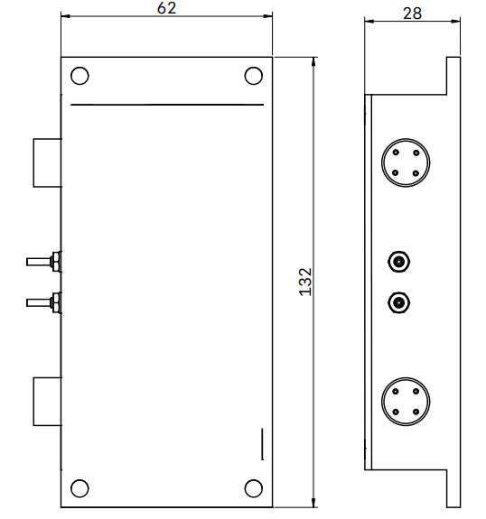
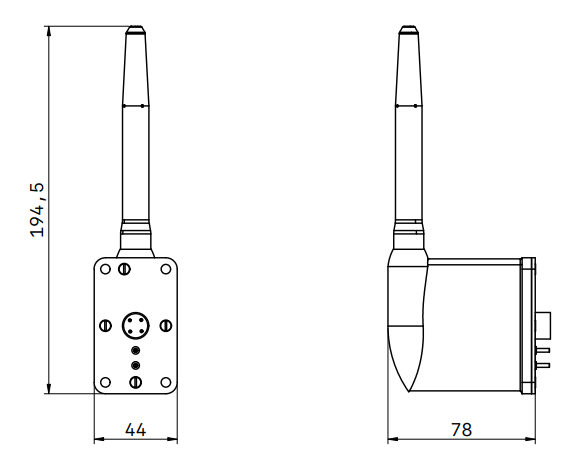

.. default-role:: term

========================
Датчик параметрів потоку
========================

Призначення виробу
==================

`ДПП` призначений для вимірювання парамтерів повітряного потоку.

Технічні вимоги до `ДПП`
========================

Склад виробу
------------

До складу виробу мають входити:

* приймач повітряного тиску `ППТ` двоканальний з підігрівом
* монтажний кронштейн приймача повітряного тиску
* блок вимірювання параметрів потоку

Блок вимірювання параметрів потоку `ДПП` містить наступні функціональні модулі:

* мембранний блок
* дренажні ємності
* модуль вимірювання абсолюного тиску з термокомпенсацією;
* модуль вимірювання перепаду тиску з термокомпенсацією;
* модуль обчислення швидкості потоку та висоти застосування.

Складу та конструкція `ДПП` можуть бути змінено згідно технічних вимог Замовника, погоджених із
Розробником.

Вимоги за призначенням
----------------------

Вимоги до каналу вимірювання висоти застосування `ДПП`
~~~~~~~~~~~~~~~~~~~~~~~~~~~~~~~~~~~~~~~~~~~~~~~~~~~~~~
* діапазон висот застосування – від -200 м до 7000 м;
* похибка оцінки висоти застосування

  * до висоти 4 км не гірше 2 метрів
  * до висоти 7 км не гірше 30 метрів

Вимоги до каналу вимірювання швидкості потоку `ДПП`
~~~~~~~~~~~~~~~~~~~~~~~~~~~~~~~~~~~~~~~~~~~~~~~~~~~
* діапазон вимірювання повітряної швидкості – до 250 м/с;
* похибка вимірювання швидкості швидності потоку 

  * до швидкості 100 м/с не гірше 2 м/с;
  * до швидкості 200 м/с не гірше 10 м/с

Вимоги до підігріву `ППТ`
~~~~~~~~~~~~~~~~~~~~~~~~~
* потужність електрообігрівача трубки Піто – не більше 10 Вт.

Вимоги до швидкодії `ДПП`
~~~~~~~~~~~~~~~~~~~~~~~~~
* обробка інформації, обчислення алгоритмів та видача сигналів
  (1 цикл формування вихідного сигналу) не більше 25 мс.

Вимоги до електроживлення `ДПП`
~~~~~~~~~~~~~~~~~~~~~~~~~~~~~~~
* Електричне живлення `ДПП` в повинне здійснюватися від 3-х елементної акумуляторної
  LiFePo4 батареї номінальною напругою 9,9 В постійного струму,
  що входить до складу постачання.
* Максимальна потужність електроспоживання всіх модулів `ДПП` без урахування
  підігріву трубки Піто, але з урахуванням підігріву основного блоку `ДПП` має
  складати не більше 10 Вт.

Вимоги по живучості та стійкості щодо впливу зовнішніх факторів
~~~~~~~~~~~~~~~~~~~~~~~~~~~~~~~~~~~~~~~~~~~~~~~~~~~~~~~~~~~~~~~
Діапазон робочих температур від мінус 45⁰С до плюс 60⁰С.

Конструктивні вимоги
~~~~~~~~~~~~~~~~~~~~

Конструктивні вимоги щодо основного блоку `ДПП`
""""""""""""""""""""""""""""""""""""""""""""""""""""

Основний блок `ДПП` має бути виконаний в окремому завадозахищеному корпусі:

* габаритні розміри корпусу повинні складати не більше (ГхВхШ) 110x30x60 мм;
* вага має складати – не більше 300 гр;
* корпус повинен бути виконаний із алюмінію;
* монтаж корпусу – гвинтовий.

Тип роз’ємів, що застосовуються у `ДПП`
"""""""""""""""""""""""""""""""""""""""""

Основний блок `ДПП` має містити наступні роз’єми із ступенем пило- та волого- захисту
не менше ніж IP65:

* роз'єм №1 підключення електроживлення та цифрового інтерфейсу зв’язку із споживачем;
* роз'єм №2 підключення електроживлення підігріву та датчика температ `ППТ`.

Вимоги щодо інформаційного забезпечення
~~~~~~~~~~~~~~~~~~~~~~~~~~~~~~~~~~~~~~~

Програмне забезпечення `ДПП` має поставлятися Замовнику записаним в довгостроковий
запам'ятовуючий пристрій контролерів `ДПП` та повністю відлагодженим.

Обмін інформацією між `ДПП` та споживачами верхнього рівня має здійснюватись
через окремий послідовний цифровий інтерфейс UART/TTL за проприєтарним
протоколом.

Опис цифрового протоколу обміну інформацією із споживачем
~~~~~~~~~~~~~~~~~~~~~~~~~~~~~~~~~~~~~~~~~~~~~~~~~~~~~~~~~

Параметри інтерфейсу
""""""""""""""""""""
* Інтерфейс – USART.
* Швидкість обміну – 19200 бод.
* Режим обміну – двонаправлений. Обмін здійснюється пакетами повідомлень незалежно.
* Розрядність – 8 біт, 1 стоп-біт.
* Контроль парності – відсутній.
* Формат повідомлень – комбінований.

Обмін здійснюється пакетами повідомлень.
Контролер незалежно передає пакети фіксованої довжини 24 байт кожні 25 мсек в режимі Streamin_mode, 
в якому контролер знаходиться одразу після старту. 
Після переходу в command_mode контролер турбки Піто приймає пакети команд фіксованої довжини 
(12 байт) і відправляє пакети з відповіддю фіксованої дожини (12 байт).

Структура пакета передачі (24 байт)
"""""""""""""""""""""""""""""""""""

[header] [pressure] [temp_1] [pressure_diff] [temp_2] [altitude] [air_speed] [temp_3] [status] 
[errors] [reserved_1] [reserved_2] [crc] [footer]

.. csv-table::

  Частина фрейму,	Розмір в байтах,	Тип,	Опис
  header,   	2,	uint8_t[2],	"Початок пакету передачі: 0xB3 і 0x39"
  pressure,	4,	float,	"Значення з датчика тиску, кПа"
  temp_1,	1,	uint8_t,	"Температура датчика тиску, градуси Цельсія + 50С" 
  pressure_diff,	4,	float,	"Значення з датчика перепаду тиску, кПа"
  temp_2,	1,	uint8_t,	"Температура датчика перепаду тиску, градуси Цельсія + 50С"
  altitude,	2,	uint16_t,	"Розраховане значення висоти, м"
  air_speed,	2,	uint16_t,	"Розраховане значення швидкості, м/с"
  temp_3,	1,	uint8_t,	"Температура в трубці, градуси Цельсія + 50С" 
  status,	1,	uint8_t,	"Регістр статусу(біт 0 – статус ввімкненості нагрівача, біти 1-7 - резервні)"
  errors,	1,	uint8_t,	"Регістр помилок (біт 0 – некоректна команда, біт 1 – помилка CRC , біт 2 – нема даних про температуру біля нагрівача, біт 3 – немає даних перепаду тиску, біт 4 – немає даних тиску)"
  reserved_1,	1,	uint8_t,	"Резервний байт"
  reserved_2,	1,	uint8_t,	"Резервний байт"
  crc,	1,	uint8_8,	"Розраховане значення CRC для фрейму"
  footer,	2,	uint8_t,	"Кінець пакету передачі: 0xCA і 0xFE"

Структура пакету команд (12 байт)
"""""""""""""""""""""""""""""""""

[header] [req_type] [parameter] [payload] [reserved] [crc] [footer]

.. csv-table::

  "Частина фрейму",	"Розмір в байтах",	Тип,	Опис
  header,   	2,	"uint8_t[2]",	"Початок пакету передачі: 0xA5 і 0x5A"
  req_type,	1,	uin8_t,	"Тип запиту: 
  0x00 – команда, 
  0x01 – читання, 
  0x02 – запис."
  param,	1,	uint8_t,	"Параметр команди чи запиту на читання/запис.
  Для команд:
  0x0A – перейти в режим streaming_mode
  0x0B – перейти в режим command_mode
  0x0C – зберегти конфігурацію у FLASH
  0x0F – перезавантажити контролер
  Для запитів читання/запису:
  0x01 – затримка під час запуску для стабілізації параметрів
  0x02 – кількість вимірювання для розрахунку значення калібровки тиску і перепаду тиску
  0x03 – включення/вимкнення калібровки тиску
  0x04 – включення/вимкнення калібровки перепаду тиску
  0x05 – верхня межа температури нагрівача
  0х06 – резерв
  0x07 – швидкість передачі даних UART"
  payload,	4,	uint8_t,	"Параметр для запитів запису, для команд і запитів читання значення payload ігнорується.
  Для запитів запису:
  2 байти затримки під час запуску для стабілізації параметрів.
  2 байт для кількість вимірювання для розрахунку значення калібровки тиску і перепаду тиску.
  1 байт включення/вимкнення калібровки тиску (0x00 – вимкнути, 0x01 - включити).
  1 байт включення/вимкнення калібровки перепаду тиску (0x00 – вимкнути, 0x01 –  включити).
  1 байт для верхньої межі температури нагрівача.
  1 байт для кількості вимірювань тиску і перепаду тиску для усереднення.
  4 байти для швидкості передачі даних UART.
  Байти, незадіяні в конфігуруванні ігноруються."
  reserved,	1,	uint8_t,	"Резервний байт"
  crc,	1,	uint8_8,	"Розраховане значення CRC для фрейму"
  footer,	2,	uint8_t,	"Кінець пакету передачі: 0xCA і 0xFE"

Структура пакету відповіді на команди (12 байт)
"""""""""""""""""""""""""""""""""""""""""""""""

[header] [req_type] [parameter] [payload] [reserved] [crc] [footer]

.. csv-table::

  "Частина фрейму",	"Розмір в байтах",	Тип,	Опис
  header,   	2,	uint8_t[2],	"Початок пакету передачі: 0xB3 і 0x39"
  req_type,	1,	uin8_t,	"Тип відповіді: 
  0x00 – команда, 
  0x01 – читання, 
  0x02 – запис."
  param,	1,	uint8_t,	"Параметр команди чи запиту на читання/запис.
  Для команд:
  0x0A – перехід в режим streaming_mode
  0x0B – перехід в режим command_mode
  0x0C – збереження конфігурації у FLASH
  0x0F – перезавантаження контроллера
  Для запитів читання/запису:
  0x01 – затримка під час запуску для стабілізації параметрів
  0x02 – кількість вимірювання для розрахунку значення калібровки тиску і перепаду тиску
  0x03 – включення/вимкнення калібровки тиску
  0x04 – включення/вимкнення калібровки перепаду тиску
  0x05 – верхня межа температури нагрівача
  0х06 – кількість вимірювань тиску і перепаду тиску для усереднення
  0x07 – швидкість передачі даних UART"
  payload,	4,	uint8_t,	"Для команд і запитів запису: 0-байт вказує на статус виконання команди (запису): 0x00 – вдале виконання/запис, 0xFF – невдале виконання/запис.
  Для запитів читання:
  2 байти затримки під час запуску для стабілізації параметрів.
  2 байт для кількості вимірювань для розрахунку значення калібровки тиску і перепаду тиску.
  1 байт включення/вимкнення калібровки тиску (0x00 – вимкнена, 0x01 - включена).
  1 байт включення/вимкнення калібровки перепаду тиску (0x00 – вимкнена, 0x01 –  включена).
  1 байт для верхньої межі температури нагрівача.
  1 байт для кількості вимірювань тиску і перепаду тиску для усереднення.
  4 байти для швидкості передачі даних UART.
  Незадіяні в байти заповнюються 0x00."
  reserved,	1,	uint8_t,	"Резервний байт"
  crc,	1,	uint8_8,	"Розраховане значення CRC для фрейму"
  footer,	2,	uint8_t,	"Кінець пакету передачі: 0xCA і 0xFE"

Формування CRC
""""""""""""""

Формування CRC включає суму всіх байтів окрім header, footer та CRC. Від цієї суми беремо 
молодший байт. Приклад коду:

.. code-block:: c

  uint8_t B339_CalcCRC(uint8_t* buffer, uint8_t from_el, uint8_t till_el) {
    uint16_t eCRC = 0;
    for(uint8_t i = from_el; i < till_el; i++) {
            eCRC += buffer[i];
    }
    return (uint8_t)(eCRC & 0x00FF);
  }

Умовні позначення
=================
   
.. glossary::
  :sorted:

  `ДПП`
    датчик параметрів потоку

  ППТ
    приймач повітряного тиску
