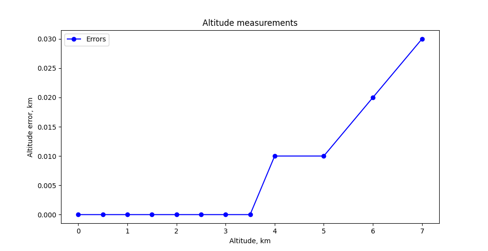

.. raw:: html

      <!-- HTML line break -->

.. raw:: html

   

        
ЗАТВЕРДЖУЮ

        
Директор ТОВ "Котрис"

        
Торхов М.І. 

   

========
Протокол
========
.. raw:: html

   

       випробування датчика системи повітряних сигналів В339
   

Тестове обладнання
==================
Автоматичний тестер систем повітряних сигналів Laversab 6300M

.. container:: image-row

   .. image:: ../_static/Laversab6300M.png
      :width: 300px

   .. image:: ../_static/tube.png
      :width: 300px

* похибка встановлення барометричної висоти :math:`\pm` 1.6 м
* похибка встановлення повітряної швидкості польота 

    * :math:`\pm` 1.0 км/год при швидкості 93 км/год
    * :math:`\pm` 0.5 км/год при швидкості 185 км/год
    * :math:`\pm` 0.1 км/год при швидкості 1204 км/год

* похибка вимірювання тиску :math:`\pm` 10 Па

Вимірювання висоти польоту
==========================
Алгоритм розрахунку
-------------------
Барометрична формула розрахунку висоти польота

.. math::

    Altitude = \frac{T_0}{1000.0 * L} * \left[1 - \left(\frac{AbsPressure}{GrounAbsdPressure} \right)
    ^{\frac{R * L}{g * M}}\right]
        
де

* :math:`L = 0.0065, K/м`  темп зростання температури по висоті
* :math:`T_0 = 288.15, K`  стандартна температура на рівні моря
* :math:`g = 9.80665, м/с^2`  прискорення вільного падіння
* :math:`M = 0.0289644, кГ/моль`  молярна маса повітря
* :math:`R = 8.31447, \frac{Дж}{моль·K}`  універсальна газова стала

Умови проведення випробувань
----------------------------
* калібрувальне значення абсолютного тиску :math:`GroundPressure=1002 \: гПа`
* температура повітря 26,5... 25,7 :math:`^{\circ}` C

Результати випробувань
----------------------
.. csv-table:: 
    :header: "Задана висота, км", "Заданий тиск, гПа", "Виіряний тиск, гПа", "Виміряна висота, км"

    0, 980, 1001, 0
    0.5, 925, 945, 0.50
    1.0, 871, 889, 1.00
    1.5, 819, 836, 1.50
    2.0, 769, 786, 2.00
    2.5, 722, 738, 2.50
    3.0, 678, 692, 3.00
    3.5, 635, 650, 3.50
    4.0, 595, 609, 4.01
    5.0, 521, 533, 5.01
    6.0, 455, 466, 6.02
    7.0, 395, 404, 7.03

Вимірювання швидкості польоту
=============================
Алгоритм розрахунку
-------------------

.. math::

    Airspeed = \sqrt{(PressureDrop-PressureDropOffset)\frac{2 * R * T_0}{P_0}}
        
де

* :math:`P_0 = 1.01325 \: Бар` - абсолютний тиск на рівні моря
* :math:`T_0 = 288.15 ^{\circ} C` - абсолютна температура на рівні моря
* :math:`R = 287 \frac{Дж}{кГ·K}` - універсальна газова стала

Умови проведення випробувань
----------------------------
* калібрувальне значення перепаду тиску:math:`PressureDropOffset = 0.00384 \: Бар`

Результати випробувань
----------------------
.. csv-table:: 
    :header: "Задана швидкість, м/с", "Заданий перепад тиску, Бар", "Виіряний перепад тиску, Бар", "Виміряна приборна швидкість, м/с", "Виміряна істинна швидкість, м/с"

    0,   0,       0,       0,     0
    20,  0.00984, 0.00672, 21.67, 22.26
    40,  0.00992, 0.01430, 41.31, 
    60,  0.01004, 0.02701, 61.5,  63.17
    80,  0.01021, 0.04490, 81.87, 84.08
    100, 0.01045, 0.06833, 102.6, 105.39
    120, 0.01073, 0.09743, 123.6, 126.95
    140, 0.01107, 0.13246, 144.9, 148.84
    160, 0.01148, 0.17383, 166.58, 171.1
    180, 0.01195, 0.22189, 188.7, 193.8
    200, 0.01250, 0.27719, 211.2, 216.95

.. image:: _static/speed.png

Головний інженер ТОВ "Котрис"

.. raw:: html

   

        Лозня С.В.
   

Начальний відділу ТОВ "Котрис"

.. raw:: html

   

        Пустовий С.О.
   

